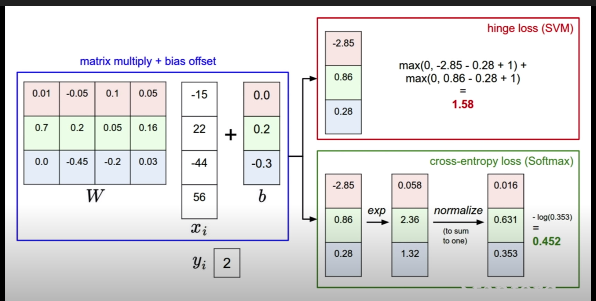
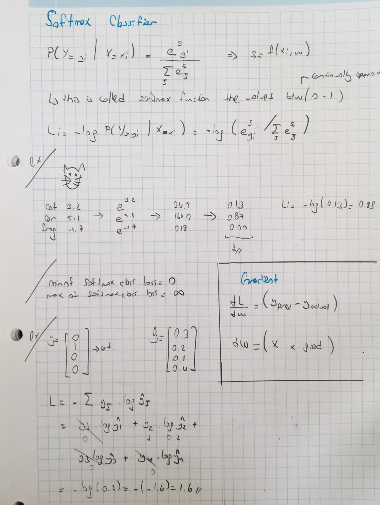

# Softmax

If you’ve heard of the binary Logistic Regression classifier before, the Softmax classifier is its generalization 
to multiple classes. 

Unlike the SVM which treats the outputs f(xi,W) as (uncalibrated and possibly difficult to interpret) scores for each 
class, the Softmax classifier gives a slightly more intuitive output (normalized class probabilities) and also has 
a probabilistic interpretation that we will describe shortly. 

In the Softmax classifier, the function mapping f(xi;W)=Wxi stays unchanged, but we now interpret these scores as the 
unnormalized log probabilities for each class and replace the hinge loss with a cross-entropy loss.

