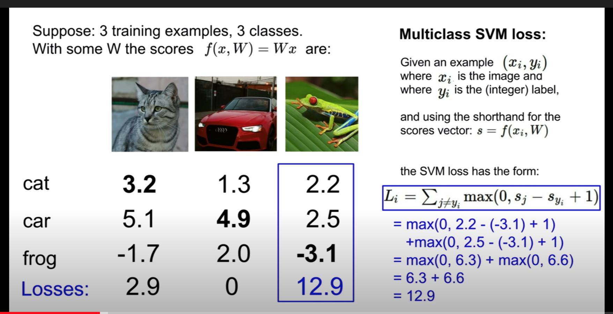
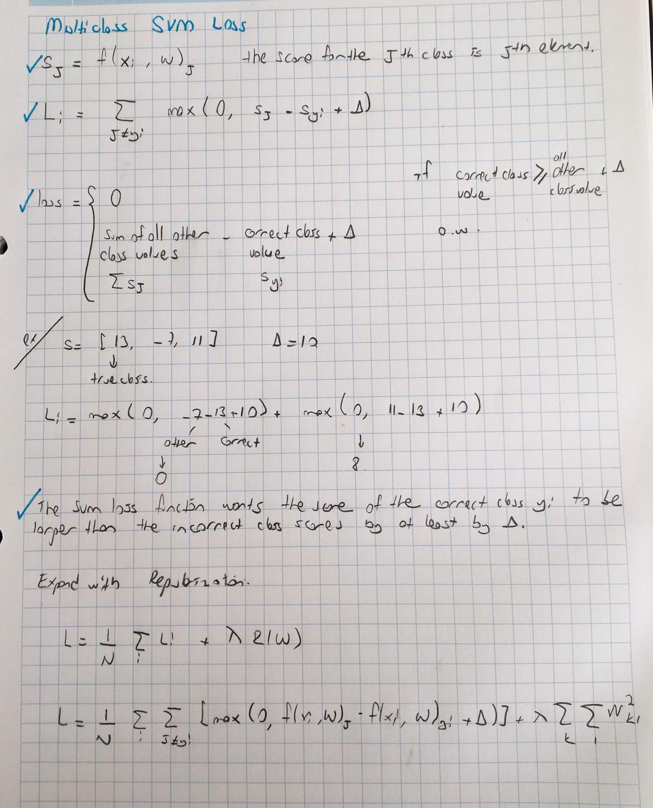
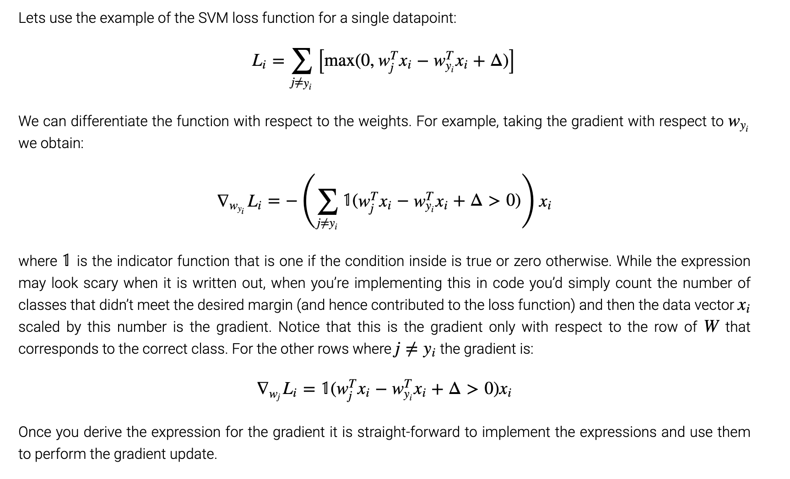
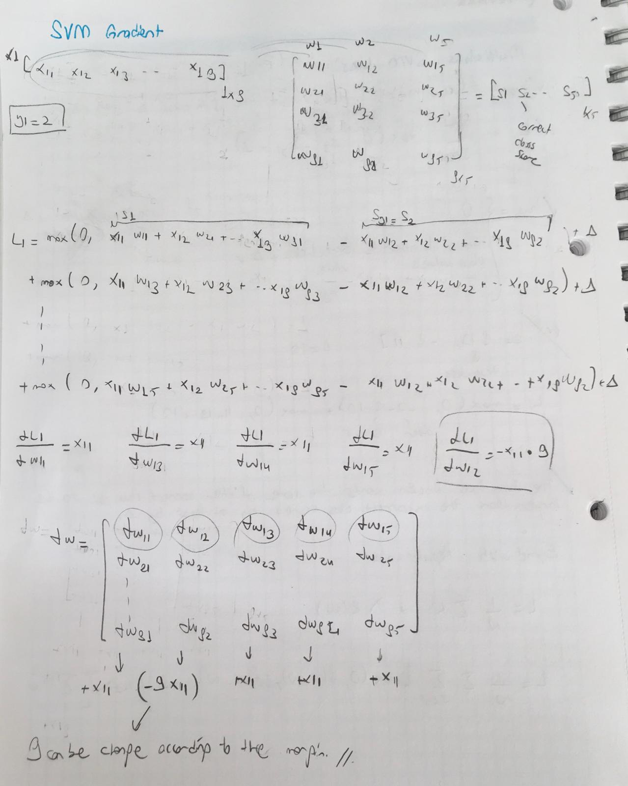

# SVM

References:

[1] https://cs231n.github.io/linear-classify/

The SVM loss is set up so that the SVM “wants” the correct class for each image to a have a score higher than the 
incorrect classes by some fixed margin Δ. 

The score function takes the pixels and computes the vector f(xi,W) of class scores, which we will abbreviate to s 
(short for scores). 
 
sj=f(xi,W)j.

Li = ∑j≠yi max(0,sj−syi+Δ)

Average Loss: (2.9 + 0 + 12.9) / 3 = 5.27

How do you choose Δ ? ---> It is safe to choose 1. 

## Regularization
You can find more than one W which makes Loss 0. For example after you find W, take double of them and still your loss is 0.
That's why we need regularizaton to find better W. 

While the W increase, the model complexity is higher and they overfits the data. But our concern is getting good accuracy on test data. 

## Notes 

## SVM Gradient

