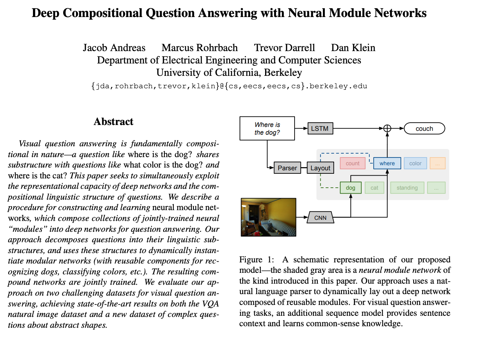
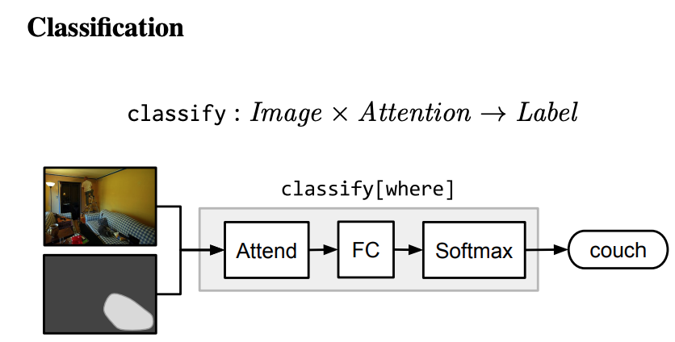
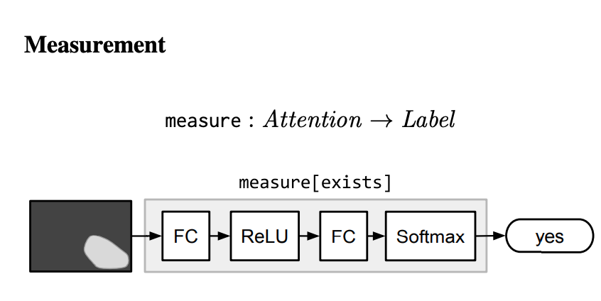

# Some Network Types

References:

- [1] https://arxiv.org/pdf/1511.02799.pdf (Question Answering)
- [2] https://arxiv.org/pdf/1601.01705.pdf (Question Answering)

- Recurrent Networks
- Recursive Networks
- Modular Network
- Question Answering
 
#### Question Answering

Ref: https://arxiv.org/pdf/1511.02799.pdf [1]

Deep Compositional Question Answering with Neural Module Networks 

They e describe a procedure for constructing and learning neural module networks, which compose collections of 
jointly-trained neural
“modules” into deep networks for question answering.

They decompose questions into their linguistic substructures, and uses these structures to dynamically instantiate 
modular networks.

The aim is : given an image and an associated question we wish to predict a corresponding
answer 

- Question ex: where is the dog?
- Expected answer ex: on the couch, or perhaps just couch

It is a significant application of human robot interaction. This requires combination of visual scenes and natural language.

The approach:

- Analyze each question with a semantic parser
- Determine basic computational units needed to answer the question

- w is a natural-language question
- x is an image
- y is an answer

The model finds P(y | w, x, &theta;) [1]

##### Modules: 

- An attention module attend[c] convolves every position in the input image with a weight vector. Ex: finds the dog's eact place in the image. 
- A re-attention module re-attend[c] is a multilayer perceptron with ReLUs, performing a fully-connected mapping from one attention
to another.  It should move attention away from the active regions.
- Combination: merges two attentions into a single attention.
- Classification: Takes original input and combined attention and maps them distribution over labels.   
    ex: distribution over colors. 
    
   
    
-Measurement: takes an attention alone and maps it to a distribution over labels.  ex: count set of objects.  [6]

   

##### Strings to Networks: 

- Map from natural language questions to layouts. 
- These layouts are used to assemble the final prediction networks.

- The parser also performs basic lemmatization, for example turning kites into kite and were into be. [1]

-----

TODO: Continue to read: Layout
