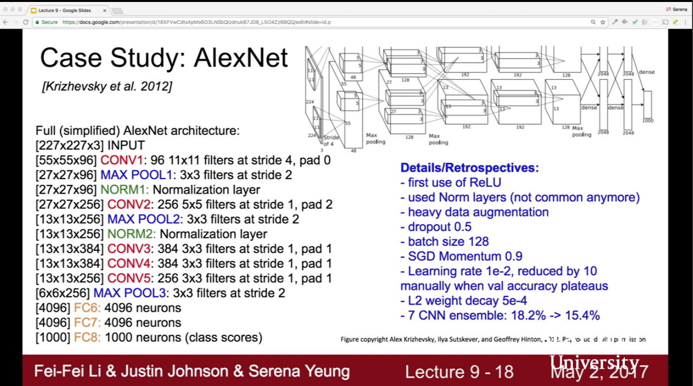
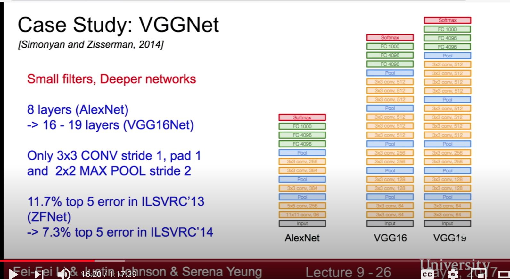
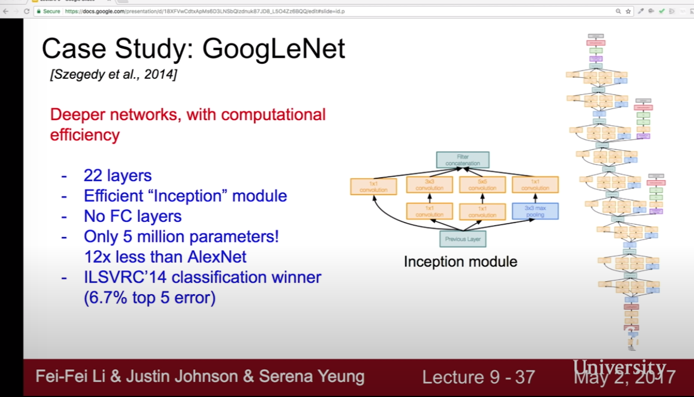
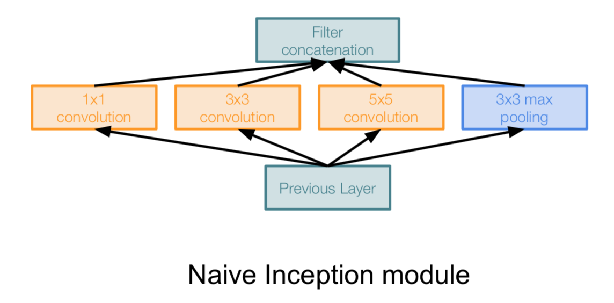
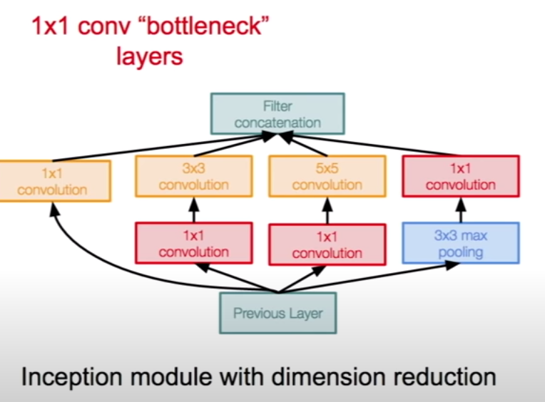
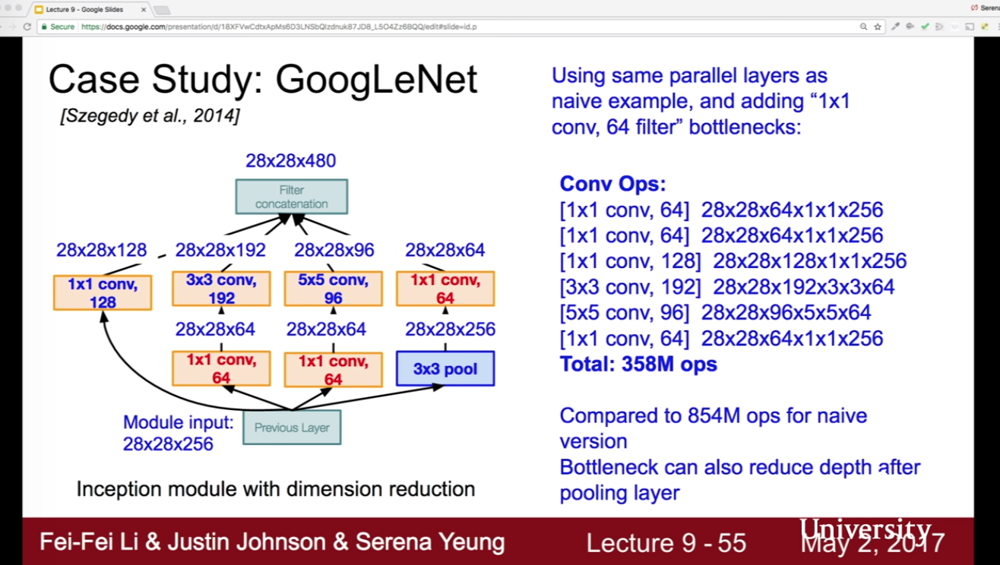
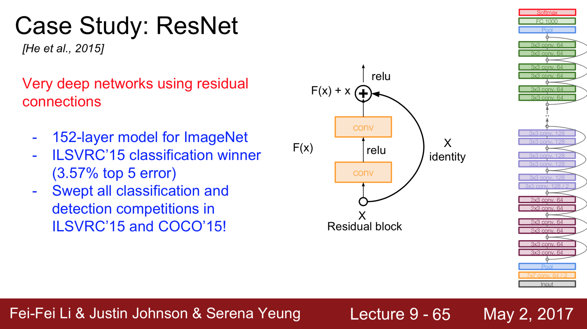
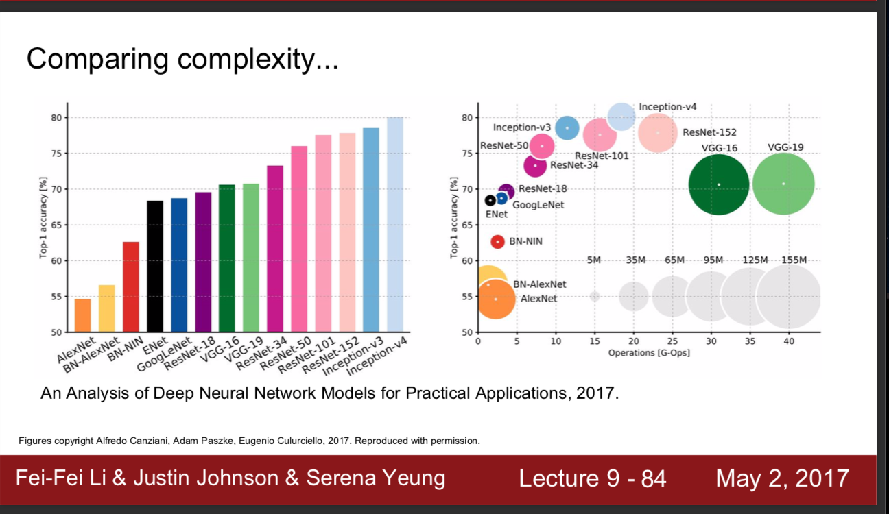
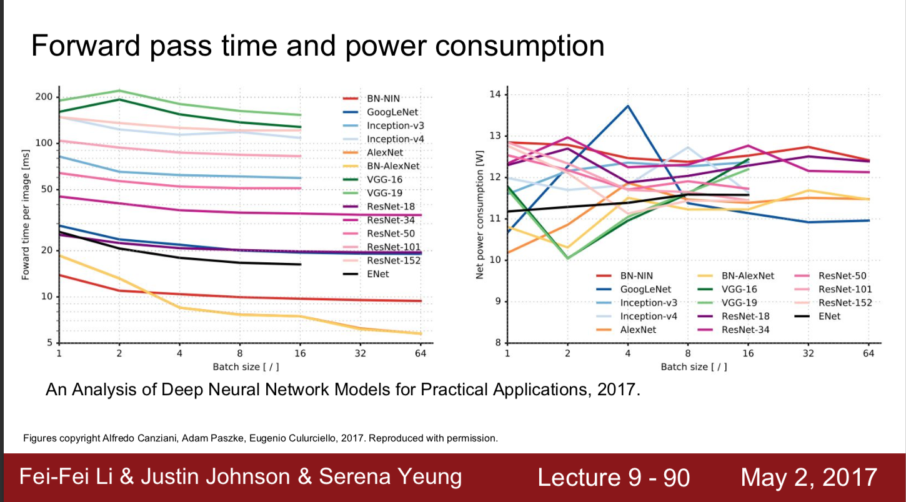

# Convolutional Neural Networks

References: 

- [1] https://cs231n.github.io/convolutional-networks/
- [2] https://www.youtube.com/watch?v=u6aEYuemt0M&ab_channel=LexFridman
- [3] https://arxiv.org/pdf/1511.07122.pdf (dilated convolutions)
- [4] https://arxiv.org/abs/1412.6806 (Getting rid of pooling)
- [5] https://www.youtube.com/watch?v=u6aEYuemt0M&ab_channel=LexFridman (Open AI)

## Convolutional Layer

Input shape: N, C, H, W

- N: there are N data points
- C: RGB Channels
- H, W: height and width of an image

Filter shape: F, C, HH, WW

- F: Number of filters
- C: RGB Channels. Same depth as input
- HH, WW: height and width of the filter. 

Output shape: N, F, H', W'
- P: padding
- S: Stride
- H' = (H + 2*P - HH) / S +1
- W' = (W + 2*P - WW) / S +1

### Example:

- Input: 227 * 227 * 3 (there are 10 data points.)
- Filter: 11 * 11 * 3 (there are 96 filters.)
- Zero padding, 4 Stride
- Output shape: (227-11 + 2*0) / 4 +1 = 55
- Output: 55 * 55 * 96

### How can we multiply input and filter?

- 11 * 11 * 3 part of the input is taken and turned to column: there are  11 * 11 * 3 = 363 element in this column. 
- It is multiplied by the 11 * 11 * 3=363 filter row. 

- Since the stride is 4, there are 55 * 55=3025 different columns in input.
- Input: 363 * 3025
- Filter: 96 * 363
- Output: 96 * 3025 ---> 96 * 55 * 55

## Max Pooling Layer

- Input: W1 * H1 * D1
- Max Pool Filter: F
- Stride: S

After pooling:
- Output: W2 * H2 * D2
- W2 = (W1 - F)/S +1
- H2 = (H1 - F)/S +1
- D2 = D1

### Example:

- Input: 224* 224 * 64
- Max Pool Filter: F : 2*2
- Stride: S : 2

After pooling:
- W2 = (224 - 2) / 2 +1 = 112
- H2 = (224 - 2) / 2 +1 = 112
- D2 = 64

### Getting Rid of pooling
Discarding pooling layers has also been found to be important in training good generative models, such as variational 
autoencoders (VAEs) or generative adversarial networks (GANs). 

It seems likely that future architectures will feature very few to no pooling layers. [1]

Ref: https://www.youtube.com/watch?v=DAOcjicFr1Y&list=PL3FW7Lu3i5JvHM8ljYj-zLfQRF3EO8sYv&index=9&ab_channel=StanfordUniversitySchoolofEngineering

# CNN Architectures

References:

- [1] https://distill.pub/2019/computing-receptive-fields/ (effective receptive fields)
- [2] https://arxiv.org/abs/1701.04128 (effective receptive fields)
- [3] https://www.learnopencv.com/number-of-parameters-and-tensor-sizes-in-convolutional-neural-network/ (parameters)
- [4] https://cs231n.github.io/convolutional-networks/#case
- [5] https://medium.com/@iamvarman/how-to-calculate-the-number-of-parameters-in-the-cnn-5bd55364d7ca (parameters)
- [6] https://arxiv.org/pdf/1512.03385.pdf (resnet)

- Alex Net
- VCG
- GoogLeNet
- ResNet
- Other Architectures

## Effective Receptive Fields

Read More anout effective receptive fileds: https://distill.pub/2019/computing-receptive-fields/

We have an image (input). We use 5 * 5 kernel for convolution. The receptive field is 5 *5. 
- Receptive field is that part of the input (image) which the conv filter at a given time T is being convoluted with.

Let's say we have another conv layer which uses the output of the first conv layer. This time we are using 3 * 3 filter. 
- Effective receptive field is the part of the original image whose pixels are being indirectly convoluted with this. 

So, in the second layer, the receptive field is 3 * , however we get the single pixel in 3 * 3 part from the 5 * 5 of 
the original image.

Ref: https://shawnleezx.github.io/blog/2017/02/11/calculating-receptive-field-of-cnn/

*Example:*

- We have an input. N * N

- 1st conv layer filter: 5*5, stride = 1
- 1st conv layer output is M * M.
- Take one pixel from this output. The receptive field is the part of the related input of 5 * 5. 
It is constructed by the dot product of input and filter. 

- 2nd conv layer uses this output. filter: 3*3 
- 2nd conv layer output is K * K.
- Take one pixel from this output. The receptive field is the part of the related 1st conv layer output of 3 * 3. 
It is constructed by the dot product of 1st conv layer and filter. 
- The effective receptive field is the part in the original image.

    In the 3*3 receptive field, every pixel is constructed by 5 * 5 part of original image. 
    For each column of 3 * 3, the 5 * 5 input is slide over 1. 
    Total slide in the original image = (2nd filter - 1) * 1st slide = (3 -1) * 1 = 2
    Before slide we have 5 * 5 part of input. So we need to sum them; 5 + (3 -1) * 1  = 7

Formula: 1st filter + (2nd filter - 1) * 1st slide

- Effective receptive field is 7 * 7

*Example:*

- 1st conv layer filter: 5*5, stride = 2
- 2nd conv layer uses this output. filter: 3*3 
- Effective Receptive Field of the final output: 5 + (3-1) * 2 = 9 --> 9*9

*Example:*

- Input
- 1st conv layer filter: 6*6, stride = 2
- 2nd conv layer uses this output. filter: 3*3, stride = 1
- 3rd conv layer uses this output. filter: 2*2, stride = 2
- Output

- Effective Receptive Field of the final output:

        
        x = 2nd filter + (3rd filter - 1) * 2nd slide
        y = 1st filter + (x- 1) * 1st slide
        
        x = 3 + (2-1) * 1 = 4
        y = 6 + (4-1) * 2 = 12

## Number of Parameters

*Convolutional Layer:*

Ref: https://www.learnopencv.com/number-of-parameters-and-tensor-sizes-in-convolutional-neural-network/

    W_c = Number of weights of the Conv Layer.
    B_c = Number of biases of the Conv Layer.
    P_c = Number of parameters of the Conv Layer.
    K = Size (width) of kernels used in the Conv Layer.
    N = Number of kernels.
    C = Number of channels of the input image.

Formulas:

    W_c = K^2 * C * N 
    B_c = N
    P_c = W_c + B_c 

Example: 

- C = Number of channels of the input image = 3
- K = Kernel size = 11
- N = Number of kernels = 96
- B = Bias = N = 96

Number of parameters:

- W_c = K^2 * C * N = 11^2 * 3 * 96 = 34,848
- B_c = N = 96
- P_c = W_c + B_c  = 34,848 + 96 = 34,944

*Fully Connected Layer:*

- N: input (Calculated by the multiplication of dimensions)
- M: Output (Number of neurons in FC)

Formula:
        
        (N+1) * M (with bias)

Example:

Let's say the architeture is: Input - Conv - Max Pool - FC 

- The output of maxpool (input of FC) is: 7x7x512
- N = 7 * 7* 512 = 25088
- M = There are 4096 neurons in FC

Number of Parameters:

- (N+1) * M = (25088 + 1) * 4096 = 102764544

## LeNet

LeCun et al., 1998

Conv - Pool - Conv - Pool - FC - FC

- Conv filters: 5*5 at stride 1
- Pooling layers applied 2*2 at stride 2

## AlexNet

[Krizhevsky et al. 2012]

Conv - Max Pool - Norm - Conv - Max Pool - Norm - Conv - Conv - Conv - Max Pool - FC - FC - FC

Example :

Input: 227* 227 * 3

Conv Layer: 
- 96 11 * 11 filters at stride 4
- Output: ((227 - 11) / 4) +1 = 55  --> 55 * 55 * 96
- Total number of parameters (weights) in this layer? 
    Number of filters * (filter size(height * weight) * input rgb size +1 ) 
    (11 * 11 * 3) * 96 = 35K
    
- Note: To be generalized the formula; instead of input rgb size, use 'number of filters in the previous layer'.
- Note2 : +1 for the bias term. 

Pooling Layer
- 3 * 3 filters at stride 2
- Output: ( (55 -3) / 2 ) +1 = 27 ---> 27 * 27 * 96
- Total number of parameters in this layer? 0! Parameters are the weights. But in pooling we have no weights. 

They use GPU with 3 GB memory, that's why we see the half of the neurons in the shape. For example in the first layer,
there are 55 * 55 * 48 output instead of 55 * 55 * 96.

## VGG Net

[Simonyan and Zisserman, 2014] from Oxford.

Deeper Networks with smaller filters. 

- 8 convolutional layers to --> 16 to 19 layers. 
- The whole VGGNet is composed of CONV layers that perform 3x3 convolutions with stride 1 and pad 1, and of POOL 
layers that perform 2x2 max pooling with stride 2 (and no padding). [4]

Q. Why use smaller filters?
- We catch more depth. 
- 3 3 * 3 conv layer has the same effective receptive field as 1 7 *7 conv layer. 

    
        x = 2nd filter + (3rd filter - 1) * 2nd slide
        y = 1st filter + (x- 1) * 1st slide
        
- x = 3 + (3-1) * 1 = 5
- y = 3 + (5-1) * 1 = 7
- y = 1st filter 
- y = 7

Q.What about the total number of parameters? 

    # of filters * (filter size(height * weight) * # of filters_pre_layer +1 ) 

- For three 3 * 3 conv layers: rgb * 3 * 3 * 1  + 1 * 3 * 3 * 1 + 1 * 3 * 3 * 1 = 9rgb + 18
- For one 7*7 conv layer: 1 * 7 * 7 * rgb = 49 rgb

Less weights, less complexity. 

- Total Params : 138 M parameters.
- Total Memory: 24 M * 4 bytes  --> only forward

## GoogLeNet

[Szegedy et al., 2014]

What is inception module?

Design a good local network topology. Stack these modules on top of eachother. 

---> Good local network : network within a network.

#### Naive Inception Module

Apply parallel filters on input from pre layer:
- Multiple receptive fields sizes ( 1*1, 3*3, 5*5)
- Pooling (3*3)

Concatenate all filter outputs together depth-wise. 

The problem is computational complexity.

Example: 

      Input:     28 * 28 * 256
      
      We are using padding and 1 stride to preserve the original image size. 
      
      Filter 1:  128 1*1        --> Output : 28 * 28 * 128
      Filter 2 : 192 3*3        --> Output : 28 * 28 * 192
      Filter 3 : 96  5*5        --> Output : 28 * 28 * 96
      Pooling  :     3*3        --> Output : 28 * 28 * 256
      
      Filter Concatenation:     --> Output: 28 * 28 * (128 + 192 + 96 + 256) = 28 * 28 * 672
      
 Convolutional Operations
  
      Filter 1:  128 1*1        --> Computation : 28 * 28 * 128 * 256 * 1 * 1
      Filter 2 : 192 3*3        --> Computation : 28 * 28 * 192 * 256 * 3 * 3
      Filter 3 : 96  5*5        --> Computation : 28 * 28 * 96 * 256 * 5 * 5
      
      total: 854M operations

Pooling layer preserves feature depth. Total depth after concatenation can only grow at every layer.

#### Solution

Use bottleneck layers. They use 1*1 convolutions to reduce feature depth. 

How?

- You have and input: 56 * 56 * 64 . Use 32 1*1 conv filters. It preserves spatial dimension but reduces the depth. 
- The output has the dimension of 56 * 56 * 32. 

Here is the structure:

Computations change by:

There are auxiliary classification outputs to inject additional gradient at lower layers. (Avg Pool , Conv, FC, FC, Softmax)
It means that you can calculate the probability of the classes 3 times in this network, you get early signals before
the end of the process and whole computations done. 

Q. Are auxiliary classifications useful for final classification?

They may average of these results. Also before smaller gradient you can get some results. READ THE PAPER! 

There are 22 total layers with weights. There are no shared weights. All of them are separate. 

## ResNet

[He et al., 2015]

I've read the paper: https://arxiv.org/pdf/1512.03385.pdf Then I can understand what the residual is =)

Revolution of Depth. Very deep network using residual connections. 

#### Does deeper network give better results all the time? 

- In test time, deeper network has doing worse, has more test errors. 
- What about training time? You expect an overfitting from your deeper network, very good results on training time. 
NOO! It still has more errors on training time. 

Why is that?

- Hypothesis: The problem of deeper network is not overfitting. It is an optimization problem. They are hard to optimize. 

#### Solution:

The deeper model should be able to perform at least as well as the shallower (not deep) model.

A solution by construction is copying the learned layers from the shallower model and setting additional layers to 
identity mapping.

"The degradation (of training accuracy) indicates that not
all systems are similarly easy to optimize. 

Let us consider a shallower architecture and its deeper counterpart that adds
more layers onto it. 

There exists a solution by construction
to the deeper model: the added layers are identity mapping, and the other layers are copied from the learned shallower
model. 

The existence of this constructed solution indicates that a deeper model should produce no higher training error
than its shallower counterpart. 

BUT experiments show that our current solvers on hand are UNABLE to find solutions that are comparably good or better 
than the constructed solution (or unable to do so in feasible time)." [6]

"Instead of hoping each few stacked layers directly fit a
desired underlying mapping, we explicitly let these layers fit a residual mapping." [6]

#### What is residual connection?

Use network layers to fit a residual mapping instead of directly trying to fit a desired underlying mapping.

- In plain layers: you have an input X. Apply conv + relu + conv to that input:
    You get H(X) = F(X) + X
    
- In residual block: F(X) = H(X) - X. We are not using H(X) directly.

We are trying to learn F(X). 

*Explanation:*
F(X) is the output of the transformation. X is input passed through the identity. We are trying to learn H(X). But it is hard
since we have very deep networks. Let's just try to learn F(X). By F(X) we are modifying the input. F(X) is the residual. 

F(X): What is delta to X. Learn this.

It is an active area of research. 

##### Full ResNet Architecture

- Stack residual blocks
- Every residual block has two 3x3 conv layers
- Periodically, double # of filters and downsample F(x) spatially using stride 2 (/2 in each dimension)
- Additional conv layer at the beginning
- No FC layers at the end (only FC 1000 to output classes)
- Use bottleneck layer to improve the depth. 

##### Training ResNet in Practice:
 
- Batch Normalization after every CONV layer
- Xavier/2 initialization from He et al.
- SGD + Momentum (0.9)
- Learning rate: 0.1, divided by 10 when validation error plateaus
- Mini-batch size 256
- Weight decay of 1e-5
- No dropout used

## Comparison 

- Inception-v4: Resnet + Inception! : Highest Accuracy
- VGG: Highest memory, most operations
- GoogleNet: Most efficient
- AlexNet: Smaller compute, still memory heavy, lower accuracy
- ResNet: Moderate efficiency depending on model, highest accuracy

## Other Architectures

### Network in Network
[Lin et al., 2014]
- Micronetwork uses multilayer perceptron (FC, i.e. 1x1 conv layers)
- MLPConvLayer

### Identity Mappings in Deep Residual Networks
*Inproving ResNets...*
[He et al., 2016]

- Improved ResNet block design from creators of ResNet
- Gives better performance

### Wide Residual Networks
*Inproving ResNets...*
[Zagoruyko et al. 2016]

- Residuals are the important factor, not depth
- Increasing width instead of depth. Use more filters for every conv layer and get wider layers.
- 50 layer wide  resnet outperforms 152 original resnet 

### Aggregated Residual Transformations for Deep Neural Networks (ResNeXt)
*Inproving ResNets...*
[Xie et al. 2016]

- Increases width of residual block through multiple parallel pathways (cardinality)

### Deep Networks with Stochastic Depth
*Inproving ResNets...*
[Huang et al. 2016]

- Reduce vanishing gradients and training time through short networks during training
- Randomly drop a subset of layers

### FractalNet: Ultra-Deep Neural Networks without Residuals
*Beyond ResNets...*
[Larsson et al. 2017]

- Residual representations are not necessary
- Fractal architecture with both shallow and deep paths to output
- Trained with dropping out sub-paths

#### Densely Connected Convolutional Networks
*Beyond ResNets...*
[Huang et al. 2017]

- Each layer is connected to every other layer in feedforward fashion
- Alleviates vanishing gradient
- Encourages faetures reuse

#### SqueezeNet: AlexNet-level Accuracy With 50x Fewer Parameters and <0.5Mb Model Size
*Efficient*
[Iandola et al. 2017]

- ‘squeeze’ layer with 1x1 filters feeding an ‘expand’ layer with 1x1 and 3x3 filters
- AlexNet level accuracy with 50x fewer parameters
