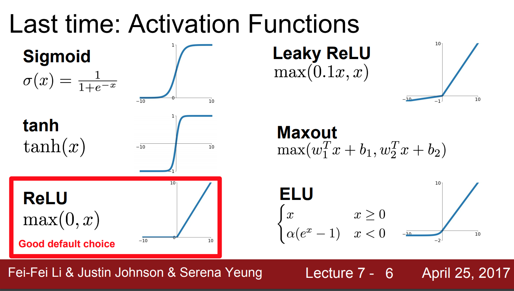

# Activation Functions

Ref: 

http://cs231n.stanford.edu/slides/2017/cs231n_2017_lecture7.pdf
http://cs231n.stanford.edu/slides/2017/cs231n_2017_lecture6.pdf

## Sigmoid
&sigmoid;(x) = 1/ (1+ e(-x))

It squashes number btw 0-1. If you have a high number you will get a number close to one and if you have a negative number 
you will get a umber lose to 0.

1. Vanishing the gradients. 

    if x = -10:
        &sigmoid;(x) = ~ 0
        gradient of Loss function wrt x: &sigmoid;(x) * (1- &sigmoid;(x))
        gradient = 0 * (1-0) = ~ 0  --> kill of the grad 
        
    if x = 10:
        &sigmoid;(x) = ~ 1
        gradient of Loss function wrt x: &sigmoid;(x) * (1- &sigmoid;(x))
        gradient = 1 * (1-1) = ~ 0  --> kill of the grad 
        
    if x = 0:
        &sigmoid;(x) = 0.5
        gradient of Loss function wrt x: &sigmoid;(x) * (1- &sigmoid;(x))
        gradient = 0.5 * (1-0.5) = ~ 0.25  --> fine for backprop
        
2. Sigmoid outputs are not zero centered.

    If all of x are positive. --> gradients are always be positive. 
    We need positive or negative values so that gradients are not always in the same directions. 
    

3. exp() is a bit expensive to compute. 

## Tanh

- It squashes the numbers to btw -1 and 1.
- It is zero centered. --> Great!
- But is still vanishing the gradients.

## Relu

max(0, x)

- Does not satuaret in region. 
- Computationally efficient.
- Converges faster. (6x)

Problems:
- Not zero centered.
- What is the gradient when x<0? --> 0      (dead Relu :( )
- What is the gradient when x = 10 ? --> 10
- What is the gradient when x = 0 ? --> 0   (dead Relu :( )

Half of the plane is activated. Basically, %10 - 20 of the networks is dead. 

Reasons of dead ReLus?

- Bad initialization. They will never be activated. 
- High learning rates. 

## Leaky Relu

f(x) = max(0.01 * x, x)

- Does not satuaret in region. 
- Computationally efficient.
- Converges faster. (6x)
- Will not die. 

## PRelu

f(x) = max(&alpha; * x, x)

## Elu

Clevert et al., 2015

    if x >0: 
        f(x) = x 
    else:
        f(x) = &alpha; * (exp(x) -1)

- Does not satuaret in region. 
- Computationally efficient.
- Converges faster. (6x)
- Closer to zero mean outputs!
- Negative saturation regime 

Negative side:
- has exp()!)

## Maxout 

f(x) = max( w1x1 + b, w2x2 +b)

- Linear regime, doesn't saturate, doesn't die! (+)

- you need weights twice (-)

## Suggestions

- Use ReLu --> be careful about learning rate. 
- Try Leaky ReLu, Maxout, Elu
- Try tanh but don't expect too much
- Don't use sigmoid!

