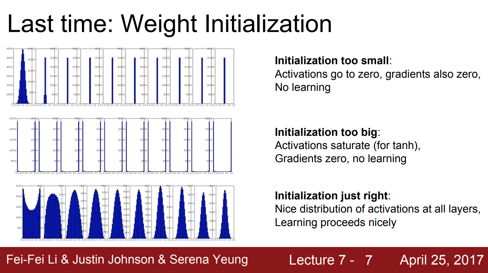

# Initialization

- [1] https://pytorch.org/docs/stable/nn.init.html
- [2] https://arxiv.org/pdf/1502.01852.pdf (kaiming init)
- [3] http://cs231n.stanford.edu/slides/2017/cs231n_2017_lecture6.pdf
- [4] http://proceedings.mlr.press/v9/glorot10a/glorot10a.pdf (xavier init)
- [5] https://towardsdatascience.com/understand-kaiming-initialization-and-implementation-detail-in-pytorch-f7aa967e9138
- [6] https://towardsdatascience.com/weight-initialization-in-neural-networks-a-journey-from-the-basics-to-kaiming-954fb9b47c79
- [7] https://stackoverflow.com/questions/49433936/how-to-initialize-weights-in-pytorch
- [8] https://www.deeplearning.ai/ai-notes/initialization/

Q. What happens when we use initialization of w=0?  [3]

- They will not dead, depending on your input value you could be in any regime of your neurons. 
- All neurons will do the same thing. They all have the same gradient. 
- They are going to update in the same way.
- Loss will be different but since they are updated in the same way, they will not learn from the loss. 

If we random initialize the weight, it will cause two problems, the vanishing gradient problem and exploding gradient 
problem. [5]

- Vanishing gradient problem means weights vanish to 0. 
- Exploding gradient problem means weights explode to infinity(NaN). [5]

*To prevent the gradients of the network’s activations from vanishing or exploding, we will stick to the following rules of thumb:*
- The mean of the activations should be zero.
- The variance of the activations should stay the same across every layer. [8]

Layer 1: 

- a --> output of that layer
- z --> input of that layer
- g --> activation function

    a_l-1 = g_l-1 (Z_l-1)
    z_l = W_l * a_l-1 + b_l
    a_l = g_l (Z_l)
    
    Wht we want:
    
    E[a_l-1 ] =  E[a_l]
    Var[a_l-1 ] =  Var[a_l]

## Small Random Numbers [3]

w = 0.01 * np.random.randn(D, H)  

randn is the gaussian with zero mean and 1e-2 std. 

- It is ok for small networks but it is a problem for deeper networks. 
- The forward values are all be zero

## Big Random Numbers [3]

w = 1 * np.random.randn(D, H)  

We are always be in saturated (Exploding gradient) regime, all values are 1 or -1

## Xavier Initialization 

w = np.random.randn(fan_in, fan_out ) / np.sqrt(fan_in)

- If you have small number of inputs, you will divide small number -> get big number.
- If you have large number of inputs, you will divide big number -> get small number.

When using Relu, it breaks! [3]

Xavier Initialization keeps the variance the same across every layer. We will assume that our layer’s activations are 
normally distributed around zero.  [8]

All the weights of layer l are picked randomly from a normal distribution with:
    - mean= 0
    - variance= 1/n_l-1 
    - where n_l-1 is the number of neuron in layer l-1. 
    - Biases are initialized with zeros.
    
    z_l = W_l * a_l-1 + b_l
    a_l = tanh(z_l)

The goal is to derive a relationship between var(a_l-1) and var(a_l).

TODO: Read the math from https://www.deeplearning.ai/ai-notes/initialization/

## Kaiming Initialization

w = np.random.randn(fan_in, fan_out ) / np.sqrt(fan_in/2)

If we create a (784, 50):

fan_in :  The number of input dimension. The fan_in is 784. It is used in the feedforward phase.
fan_out : The fan_in is 50. It is used in the backpropagation phase. 

It works much better than Xavier. [3]

A bad initialization can still hamper the learning of a highly non-linear system. [2]

Recent deep CNNs are mostly initialized by random weights drawn from Gaussian distributions. 
With fixed standard deviations (e.g., 0.01 in), very deep models (e.g., >8 conv layers) have 
difficulties to converge, as reported by the VGG team and also observed in our experiments. [2]

Solution 1: To address this issue, VGG team pre-train a
model with 8 conv layers to initialize deeper models. But
this strategy requires more training time, and may also lead
to a poorer local optimum.

Solution 2: Glorot and Bengio proposed to adopt a properly
scaled uniform distribution for initialization. This is called
“Xavier” initialization. Its derivation is based on the
assumption that the activations are linear. This assumption
is invalid for ReLU and PReLU. [2]

Solution 3: Kaiming Initialization. This method allows for extremely
deep models (e.g., 30 conv/fc layers) to converge, while the
“Xavier” method cannot.

The mean increment slowly and std is close to 1 in the feedforward phase. 
And such stability will avoid the vanishing gradient problem and exploding gradient 
problem in the backpropagation phase. [5]

Check this ipynb file for more information about Xavier and Kaiming initializations. [code](initialization_examples.ipynb)
Paper: https://towardsdatascience.com/weight-initialization-in-neural-networks-a-journey-from-the-basics-to-kaiming-954fb9b47c79

## Relu & Kaiming

Ref:https://www.machinecurve.com/index.php/2019/09/16/he-xavier-initialization-activation-functions-choose-wisely/

The difference btw Xavier and Kaiming is related to the nonlinearities of the ReLU activation function, 
which make it non-differentiable at 𝑥=0. However, Kumar indeed proves mathematically that for the ReLU activation 
function, the best weight initialization strategy is to initialize the weights randomly but with this variance: 2/N
which is He  (Kaiming) initialization.

The math behind 2/N is explained here: https://pouannes.github.io/blog/initialization/

## Example in CNN

     # Kaiming Initialization 
        self.conv1 = nn.Conv2d(in_channel, channel_1, filter_1, padding=pad_1)
        self.conv2 = nn.Conv2d(channel_1, channel_2, filter_2, padding=pad_2)
        self.fc = nn.Linear(channel_2 * H_out * W_out, num_classes)

        # Initialize weights
        nn.init.kaiming_normal_(self.conv1.weight)
        nn.init.constant_(self.conv1.bias, 0)

        nn.init.kaiming_normal_(self.conv2.weight)
        nn.init.constant_(self.conv2.bias, 0)

        nn.init.kaiming_normal_(self.fc.weight)
        nn.init.constant_(self.fc.bias, 0)
        
        
     # Xavier initialization
        # nn.init.xavier_uniform(self.conv1.weight)

     # def init_weights(m):
    if type(m) == nn.Linear:
        torch.nn.init.xavier_uniform(m.weight)
        m.bias.data.fill_(0.01)

    net = nn.Sequential(nn.Linear(2, 2), nn.Linear(2, 2))
    net.apply(init_weights)