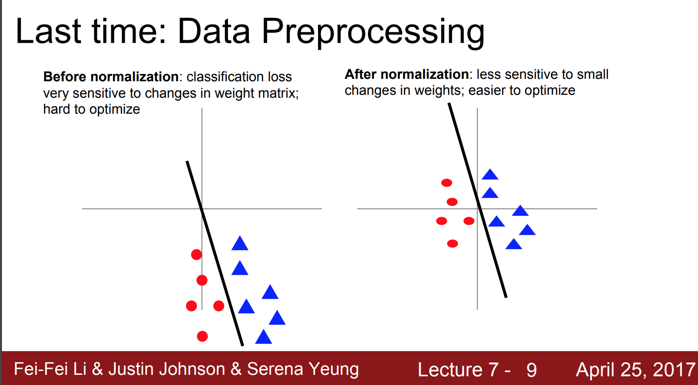

# Training NN

### References:

- https://cs231n.github.io/neural-networks-3/#sgd **
- https://www.jmlr.org/papers/volume13/bergstra12a/bergstra12a.pdf (hyperparameter search)
- https://arxiv.org/pdf/1312.6055.pdf : Unit test - deepmind
- http://yann.lecun.com/exdb/publis/pdf/lecun-98b.pdf (efficient backprop, tricks)
- https://arxiv.org/pdf/1206.5533v2.pdf (Practical Recommendations)

### Outline

- [Baby_Steps_of_Training]()
- [Hyperparameter_Tuning]()
- [Activation_Functions](Activation_Functions.md)
- [Initialization](Initialization.md)
- [Loss Loss_Functions_Gradients](Loss_Functions.md)
- [Optimization_Algorithms](Optimization_Algorithms.md)

## Baby Steps of Training 

1.  Preprocess the data --> zero mean the data.

    **Zero centered data: X -= np.mean(X, axis=0)**
    
    **Normalize data: X /= np.std(X, axis=0)**
    
    In practise:
    - Subtract the mean image  (Alex Net)
    - Subtract per-channel (RGB) mean  (VCG Net)
    
    If you don't preprocess the data, all data may be positive, it leads to all gradients on w be positive. The update direction will
    always be positive. This is why we want zero mean data. 
    
    !! Do the same preprocessing for the test set. 
    
    

2. Choose the arcthitecture: how many hidden nodes, how many neurons ?

3. Double check if the loss is reasonable. (disable regularization)

    For cifar10 classification; there are 10 classes. With equal probability; 
    each class has 0.1 probability. That means, the correct class also has the probability of 0.1 
    
        -ln(0.1) = 2.30  --> the loss would be around 2.3
        
4. Add regularization and check the loss again. It should be higher. 
5. Start training with a small amount of data:

        Epochs = 200 
        Reg = 0
        
   The loss should be around 0, since the model should overfit the data. 
   
6. Take full training data. 

        Reg = 0.0000001
        Figure out what a good learning rate is. 
        

**Question:** 

- learning rate = 1e^-6 
- 1st epoch loss: 2.3025, accuracy: 0.0
- 10the epoch loss: 2.3024 accuracy: 0.20

Why? 

The loss is not changing too much, we understand that the learning rate is too small. But the accuracy is increasing well. 
the reason is that in each epoch the weights are changing in the right direction and we are taking the max probability as a predicted class. Even the probability
of the correct class is 0.2 and this is the max of the rest of them we take it as predicted class. The loss is still very bad but our accurac jump to 0.20.

**Question:**

cost : NaN --> what is that mean? 

It means that the cost is exploded. It always means that lr is TOO high. 

7. You can use cross validation to choose the best hyperparameters (train for a few epochs)

8. Random search also give better results for searching. 

## Hyperparameter Tuning

Ref: https://towardsdatascience.com/simple-guide-to-hyperparameter-tuning-in-neural-networks-3fe03dad8594

Example:
SGD: Typical values are lr=0.01, decay=1e-6, momentum=0.9, and nesterov=True.

-  Adjust learning rate
- Decay lr: 
    
    
    lr=lr×1/(1+decay∗epoch)   --> decay in each epoch
    decay_rate = learning_rate / epochs
    
    lr = lr0 × e^(-kt)    --> exponential decay

-  Choose Optimizer & loss function 

    sgd, adam, rmsprop...
    cross entropy, softmax, svm
    

-  Decide batchsize and # epochs

        - One epoch means that each sample in the training dataset has had an opportunity to update the internal 
        model parameters.
        - The smaller the batch the less accurate the estimate of the gradient will be.
        - Typically networks train faster with mini-batches. That’s because we update the weights after each propagation.

- Use Different Initialization

    init_mode = ['uniform', 'lecun_uniform', 'normal', 'zero', 
             'glorot_normal', 'glorot_uniform', 'he_normal', 'he_uniform']

