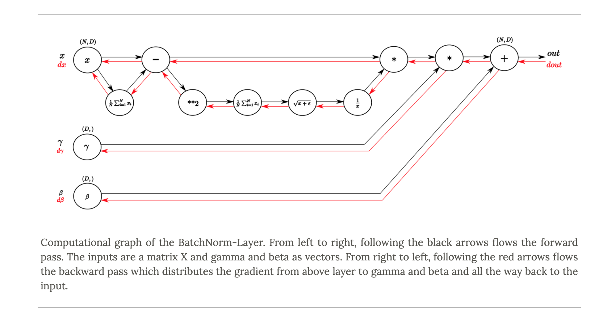
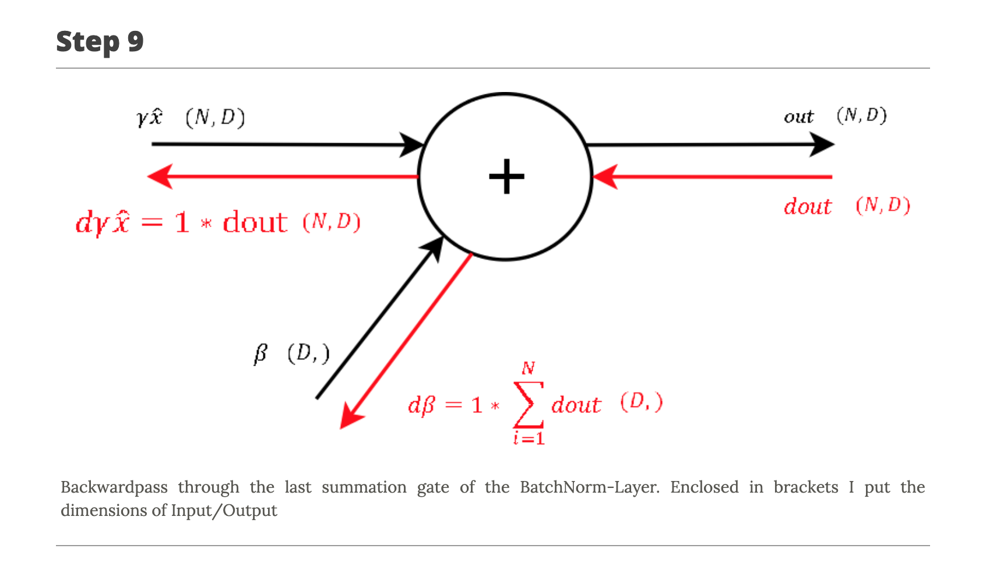
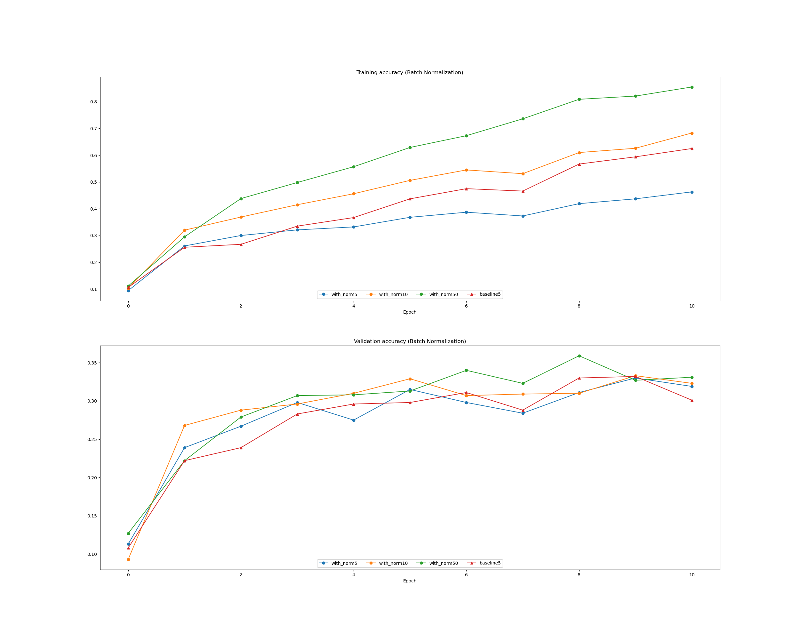
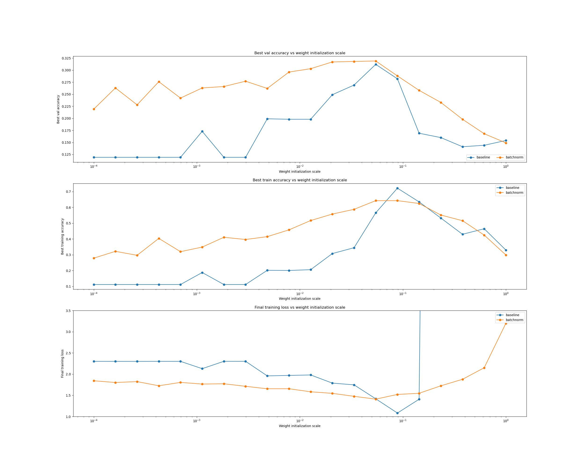

# Batch Normalization 

References:

- https://kratzert.github.io/2016/02/12/understanding-the-gradient-flow-through-the-batch-normalization-layer.html [1] (back prop)
- https://colab.research.google.com/drive/10Yu8mK_phAwwXu4tAEDWVrAKbmOKU1pu#scrollTo=azyoHJ199Faw

Machine learning methods tend to work better when their input data consists of uncorrelated features with zero mean and 
unit variance. 

We can preprocess the data before feeding it to the network to explicitly decorrelate its features --> this will ensure 
that the first layer of the network sees data that follows a nice distribution.

**So, what is the problem?**

Even if we preprocess the input data, the activations at deeper layers of the network will likely no longer be decorrelated
and will no longer have zero mean or unit variance since they are output from earlier layers in the network !
 
Even worse, during the training process the distribution of features at each layer of the network will shift as the 
weights of each layer are updated.

**Solution**

Insert batch normalization layers into the network.

- At training time, a batch normalization layer uses a minibatch of data to estimate the mean and standard deviation of 
each feature. 
- These estimated means and standard deviations are then used to center and normalize the features of the minibatch. 
- A running average of these means and standard deviations is kept during training, and at test time these running 
averages are used to center and normalize features.

x_norm = (x - mean(x)) / sqrt(var(x))

# Batch Normalization Paper Summary

Ref: https://arxiv.org/abs/1502.03167 (Batch Normalization: Accelerating Deep Network Training by Reducing Internal Covariate Shift) 

### Introduction

- Batch Normalization allows us to use much higher learning rates and
be less careful about initialization.

- It also acts as a regularizer, in some cases eliminating the need for Dropout

Using mini-batches:

- First, the gradient of the loss over a mini-batch is an estimate of the gradient
over the training set, whose quality improves as the batch
size increases.

- Second, computation over a batch can be much more efficient than
m computations for individual examples, due to the parallelism afforded by the modern
computing platforms.

Problems:

- SGD requires careful tuning of the model hyper-parameters,
specifically the learning rate used in optimization, as well
as the initial values for the model parameters. 

- The training is complicated by the fact that the inputs to each layer
are affected by the parameters of all preceding layers – so
that small changes to the network parameters amplify as
the network becomes deeper.

- The layers need to continuously adapt to the new distribution --> covariate shift. 

- In practice, the saturation problem and the resulting vanishing gradients are usually addressed by using Rectified 
Linear Units (ReLU)

- If , however,  we could ensure that the distribution of nonlinearity inputs remains more
stable as the network trains, then the optimizer would be
less likely to get stuck in the saturated regime, and the
training would accelerate.

### How to do it?

BN is a normalization step that fixes the means and variances of layer inputs.

It reduces the dependence of gradients on the scale of the parameters or of their initial values

This allows us to use much higher learning rates without the risk of divergence.

Batch Normalization makes it possible to use saturating non-linearities
by preventing the network from getting stuck in the saturated modes.

### Reduce Internal Covariate Shift

By whitening the inputs to each layer,
we would take a step towards achieving the fixed distributions of inputs that would remove the ill effects of the
internal covariate shift.

Solution for: the gradient descent optimization does not take into account the fact
that the normalization takes place. 

### Normalization via Mini-Batch

Since the full whitening of each layer’s inputs is costly
and not everywhere differentiable, we make two necessary simplifications.

!! Note that simply normalizing each input of a layer may change what the layer can represent.

To accomplish this:

For each activation, a pair of parameters gamma and beta, will be used for scale and shift the normalized value. 

    For a layer with d dimensional input; x= ( x(1), ..x(d))
    x_norm(k) = x(k) - mean(x(k))  / sqrt(var(x(k)))
    y(k) = gamma(k) * x_norm(k) +beta(k)
 
Gamma and beta are learned with the original model parameters.

    gamma(k) = sqrt(var(x(k))
    beta(k) = mean(x(k))
    
Let focus on x(k) and omit k. 
- minibatch --> B = {x1,2,3...m}
- normalized values --> x_norm = {x_norm1,2,...m}
- we know the parameters gamma and beta, let's use them for normalization:
    
    BN(gamma, beta): x1,...m --> y1,....m

The scaled and shifted values y are passed to other network layers.

The distributions of values of any xb has the expected value of 0
and the variance of 1, as long as the elements of each mini-batch are sampled from the same distribution.

## Backpropagation

BN transform is a differentiable transformation that introduces normalized activations into the network.

You can read the paper [1] for detailed explanations of backpropagation. Here I add two pictures from this website:

How to backpropagate?

## Effect of Batch size

When the batch size increases, training and validation accuracy also incrase:

## Effect of Weight Scale Initialization

We an select the pick point whic is btw 10-2 and  10-1.

## CNN Application

Ref: https://pytorch.org/docs/stable/generated/torch.nn.BatchNorm2d.html#torch.nn.BatchNorm2d

torch.nn.BatchNorm2d(num_features, eps=1e-05, momentum=0.1, affine=True, track_running_stats=True)

For the input: (N,C,H,W) where:
        - N = number of observations
        - C = number of channels
        - H, W = spatial sizes
        
number_features = C 

Which means that we are calculating mean and variance for each C. 

"The mean and standard-deviation are calculated per-dimension over the mini-batches and &gamma; and &beta; are 
learnable parameter vectors of size C (where C is the input size). 

By default, the elements of &gamma; are set to 1 and the elements of &beta; are set to 0. 

The standard-deviation is calculated via the biased estimator, equivalent to torch.var(input, unbiased=False).

Because the Batch Normalization is done over the C dimension, computing statistics on (N, H, W) slices, 
it’s common terminology to call this Spatial Batch Normalization."

 