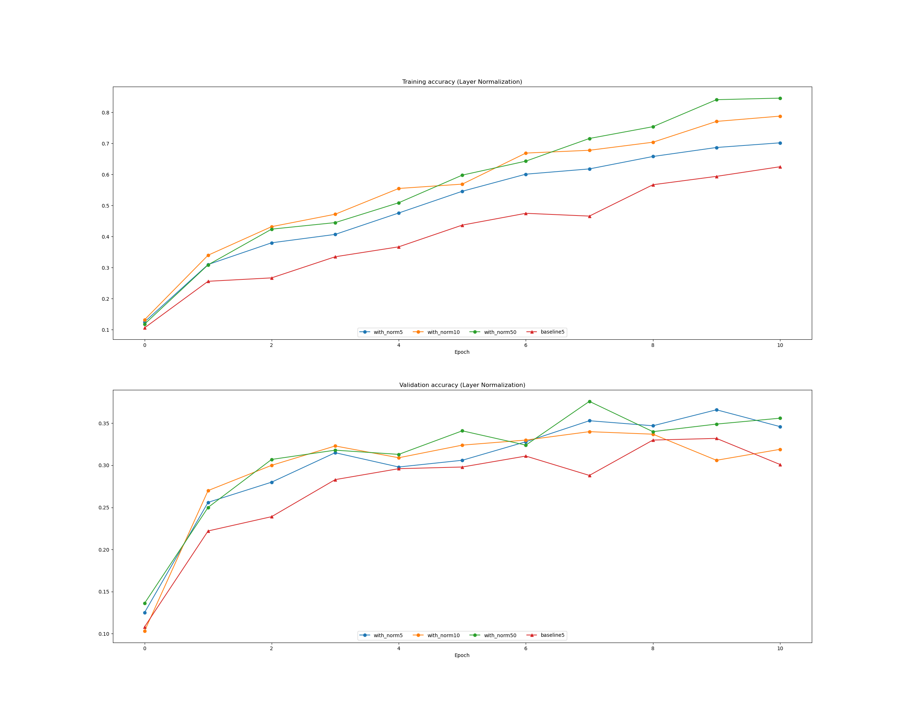

# Layer Normalization 

References:

- https://arxiv.org/pdf/1607.06450.pdf (Layer Normalization - Toronto) [1]
- https://mlexplained.com/2018/01/13/weight-normalization-and-layer-normalization-explained-normalization-in-deep-learning-part-2/ [2]
- https://colab.research.google.com/drive/10Yu8mK_phAwwXu4tAEDWVrAKbmOKU1pu#scrollTo=VOau-5NPe8mj [3
- https://leimao.github.io/blog/Layer-Normalization/ [4]
- https://mlexplained.com/2018/01/13/weight-normalization-and-layer-normalization-explained-normalization-in-deep-learning-part-2/ [5]
- https://arxiv.org/pdf/1803.08494.pdf (Group Normalization)

Batch normalization uses the distribution of the summed input to a neuron over a mini-batch of training cases 
to compute a mean and variance which are then used to normalize the summed input to that
neuron on each training case [1]

The effect of batch normalization is dependent
on the mini-batch size and it is not obvious how to apply it to recurrent neural networks. [1]

In this paper, we transpose batch normalization into layer normalization by
computing the mean and variance used for normalization from all of the summed
inputs to the neurons in a layer on a single training case. [1]

Unlike batch normalization, layer normalization performs exactly the same computation at training and test times. [1]

## Introduction 

How to speed up the nn?

- compute gradients for different subsets of the training cases on different machines.
- split the neural network itself over many machines
- modify the computations performed in the forward pass of the neural net to make learning easier.
- batch normalization (Ioffe and Szegedy, 2015) has been proposed to reduce training time by including additional normalization
stages in deep neural networks.
- The normalization standardizes each summed input using its mean
and its standard deviation across the training data. 
- the stochasticity from the batch statistics serves as a regularizer during training. [1]

cons of bn:

- batch normalization requires running averages of the summed input statistics.
- it is straightforward to store the statistics separately
for each hidden layer. 
-  applying batch normalization to RNNs appears to require different statistics for different time-steps.
- batch normalization cannot be applied to online learning tasks or to extremely large distributed models where the
minibatches have to be small. [1]

- The mean and variance will differ for each mini-batch. This dependency causes two main problems:
    1. It puts a lower limit on the batch size
    2. It makes batch normalization difficult to apply to recurrent connections in recurrent neural network [2]

Limit on the batch size:

we want to use the global mean and variance to normalize the inputs to a layer. However, computing the mean across the 
entire dataset after each update of the network is far too costly. We estimate the mean and variance using mini-batch statistics. 
we have to be extra careful about the batch size when using SGD with batch normalization. [2]

It is a problem in online learning (where single examples are processed at individually) and reinforcement learning which
 is highly sensitive to noise.

RNN:
It is common among the NLP tasks to have different sentence lengths for different training cases. This is easy to
deal with in an RNN because the same weights are used at every time-step. [1]

But when we apply batch normalization to an RNN in the obvious way, we need to to compute and store separate statistics for
each time step in a sequence. [1]

The recurrent activations of each time-step will have different statistics. This means that we have to fit a separate 
batch normalization layer for each time-step. This makes the model more complicated and - more importantly - it forces 
us to store the statistics for each time-step during training. [2]

Under layer normalization, all the hidden units in a layer share the same normalization terms
mean and std, but different training cases have different normalization term. [1]

# How does Layer Normalization work?

Batch normalization normalizes the input features across the batch dimension. The key feature of layer normalization 
is that it normalizes the inputs across the features. [2]

In layer normalization, the statistics are computed across each feature and are independent of other examples. [2]

xij == > i is batch,  j is features.

X N,D = x 10, 3 ==> 10 observations, 3 features. 

    1st obs:  x11, x12, x13
    2nd obs:  x21, x22, x23
    ...
    10th obs: x101, x102, x103

Batch normalization:

mu_j = sum_i (1... N) Xij / N
mu_j = x1j + x2j + ... + x10j / 10 

We obtain: mu_1, mu_2, mu_3 ---> same for all training examples. 

    (x11 - mu_1) / std_1    (x12 - mu_2) / std_2   (x13 - mu_3) / std_3 
    (x21 - mu_1) / std_1    (x22 - mu_2) / std_2   (x23 - mu_3) / std_3 
    (x31 - mu_1) / std_1    (x32 - mu_2) / std_2   (x33 - mu_3) / std_3 
    
    ..
    (x101 - mu_1) / std_1    (x102 - mu_2) / std_2   (x103 - mu_3) / std_3 
    

Layer normalization:

mu_i = sum_j (1... D) Xij / D
mu_i = xi1 + xi2 + xi3 /3

We obtain: mu_1, mu_2, mu_3, ... mu_10 

    (x11 - mu_1) / std_1    (x12 - mu_1) / std_1   (x13 - mu_1) / std_1 
    (x21 - mu_2) / std_2    (x22 - mu_2) / std_2   (x23 - mu_2) / std_2 
    (x31 - mu_3) / std_3    (x32 - mu_3) / std_3   (x33 - mu_3) / std_3 
    
    ..
    (x101 - mu_10) / std_10    (x102 - mu_10) / std_10   (x103 - mu_10) / std_10

# Assignment  

Batch normalization has proved to be effective in making networks easier to train, but the dependency on batch size makes 
it less useful in complex networks which have a cap on the input batch size due to hardware limitations. [3]

Several alternatives to batch normalization have been proposed to mitigate this problem; one such technique is Layer 
Normalization [1]. Instead of normalizing over the batch, we normalize over the features. In other words, when using 
Layer Normalization, each feature vector corresponding to a single datapoint is normalized based on the sum of all terms 
within that feature vector. [3]

Question: [3]

Which of these data preprocessing steps is analogous to batch normalization, and which is analogous to layer normalization?

1. Scaling each image in the dataset, so that the RGB channels for each row of pixels within an image sums up to 1.
2. Scaling each image in the dataset, so that the RGB channels for all pixels within an image sums up to 1.
3. Subtracting the mean image of the dataset from each image in the dataset.
4. Setting all RGB values to either 0 or 1 depending on a given threshold.

Answer: 

[2] is layer normalization. Take an image, scale according to the dimensions. RGB channels for all pixels within an image sums up to 1.

[3] is batch normalization. mean image is calculating by the mean of each dimension. when we subtract it from all images we get the batch norm. 

## Effect of batchsize

We can use batch size of 5 to get better validation accuracy, but if we haven't got a problem with time & space 50 will get better results. 

