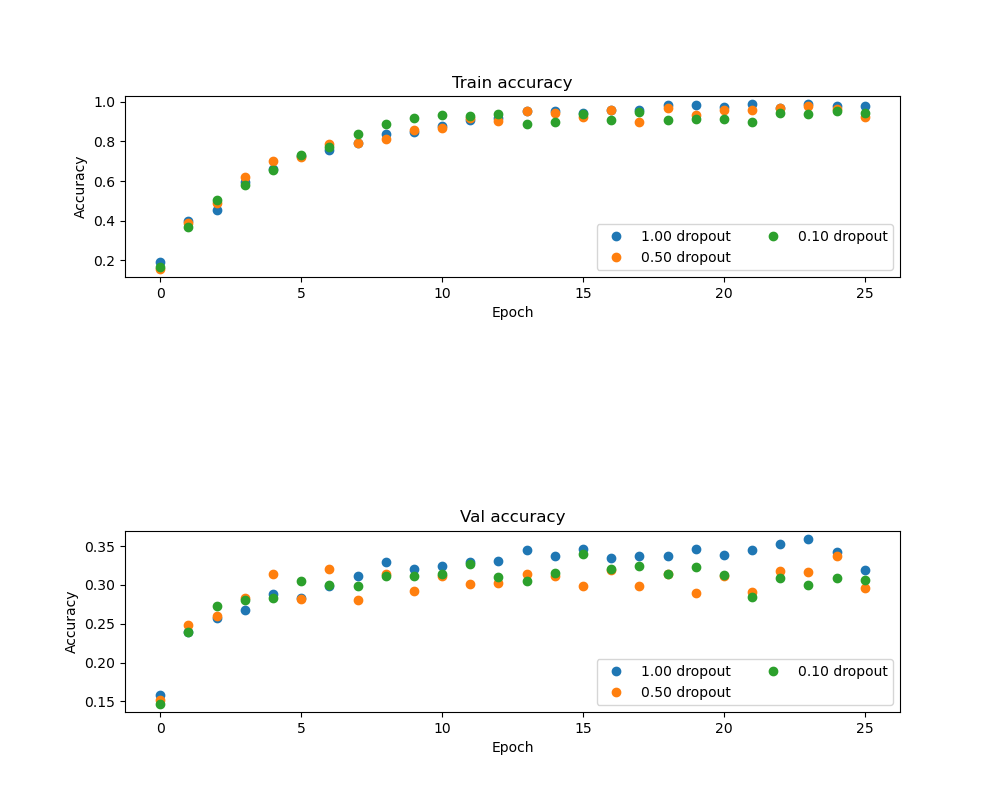
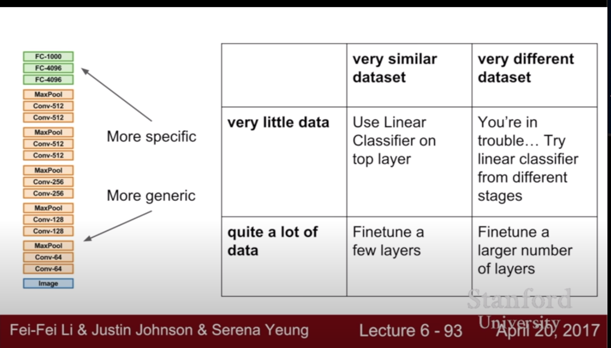

# Regularization

Loss = 1/n sum max( f(x_i,W)_j - -f(x_i,W)_yi  +1) ) + &lambda; * R(W)

- L2 regularization --> R(W) = sum(W**2)
- L1 regularization --> R(W) = sum(abs(W))
- Elastic net (L1 + L2) --> R(W) =  sum ((&Beta; * W**2) + abs(W)) 
    Ref: http://web.stanford.edu/~hastie/Papers/B67.2%20%282005%29%20301-320%20Zou%20&%20Hastie.pdf
- Dropout
- Data Augmentation
- Transfer Learning

# Data Augmentation

- Horizontal Flips
- Random crops and scales
    Example: ResNet:
    
    Training: sample random crops / scales
        1. Pick random L in range [256, 480]
        2. Resize training image, short side = L
        3. Sample random 224 x 224 patch
        
    Testing: average a fixed set of crops   
        1. Resize image at 5 scales: {224, 256, 384, 480, 640}
        2. For each size, use 10 224 x 224 crops: 4 corners + center, + flips 
    
- Color Jitter
     1. Apply PCA to all [R, G, B] pixels in training set
     2. Sample a “color offset” along principal component directions
     3. Add offset to all pixels of a training image
    

# Dropout

References:

- [1] https://cs231n.github.io/neural-networks-2/#reg
- [2] https://arxiv.org/pdf/1207.0580.pdf
- [3] http://www.cs.toronto.edu/~rsalakhu/papers/srivastava14a.pdf
- [4] http://papers.nips.cc/paper/4882-dropout-training-as-adaptive-regularization.pdf

- ⭐️ dropout: Scalar between 0 and 1 giving dropout strength. If p=1 then the network should not use dropout at all.
- ⭐️ In Pytorch p is probability of an element to be zeroed. So if p=0 the network should not use dropout at all
- ⭐️ At test time all neurons are active always
=> We must scale the activations so that for each neuron:
output at test time = expected output at training time [1]
- ⭐️ At test time, multiply by dropout probability

The term “dropout” refers to dropping out units (hidden and
visible) in a neural network. By dropping a unit out, we mean temporarily removing it from
the network, along with all its incoming and outgoing connections. [3]

Dropout is a technique that addresses these issues: It prevents overfitting and
provides a way of approximately combining exponentially many different neural network
architectures efficiently. [3]

The choice of which units to drop is random. [3]

Random dropout makes it possible to train a huge number of different networks in a reasonable time. [2]

In the simplest case, each unit is retained with a fixed probability p independent of other units, 
where p can be chosen using a validation set or can simply be set at 0.5, 
which seems to be close to optimal for a wide range of networks and tasks. [3]

**************
A unit at training time that is present with probability p and is connected to units
in the next layer with weights w.
 
At test time, the unit is always present and the weights are multiplied by p. 
The output at test time is same as the expected output at training time. [3]

**************

The idea is to use a single neural net at test time without dropout. The weights
of this network are scaled-down versions of the trained weights. If a unit is retained with
probability p during training, the outgoing weights of that unit are multiplied by p at test
time. [3]

⭐️ !!!! Important --> weights of the units are multiplied by p at test time !!!!!

The idea of dropout is not limited to feed-forward neural nets. It can be more generally
applied to graphical models such as Boltzmann Machines. [3]

***************
Boltzmann Machine?

It  is a type of stochastic recurrent neural network. It is a Markov random field.

A Boltzmann machine, like a Hopfield network, is a network of units with an "energy" (Hamiltonian) defined for the 
overall network. Its units produce binary results.

The gloabal energy:

E = sum ( w_ij * s_i * s_j) + sum(&theta;_i * s_i)  where;

- w_ij is the connection strength between unit j and unit i.
- s_i is the state, si is the element of {0, 1}
- &theta;_i is the bias of unit i. 

Ref: https://en.wikipedia.org/wiki/Boltzmann_machine

*************

While training, dropout is implemented by only keeping a neuron active with some probability p (a hyperparameter), or 
setting it to zero otherwise. [1]

During training, Dropout can be interpreted as sampling a Neural Network within the full Neural Network, and only 
updating the parameters of the sampled network based on the input data. [1]

During testing there is no dropout applied, with the interpretation of evaluating an averaged prediction across the 
exponentially-sized ensemble of all sub-networks. [1]
 

    """ 
    Inverted Dropout: Recommended implementation example.
    We drop and scale at train time and don't do anything at test time.
    """
    
    p = 0.5 # probability of keeping a unit active. higher = less dropout
    
    def train_step(X):
      # forward pass for example 3-layer neural network
      H1 = np.maximum(0, np.dot(W1, X) + b1)
      U1 = (np.random.rand(*H1.shape) < p) / p # first dropout mask. Notice /p!
      H1 *= U1 # drop!
      H2 = np.maximum(0, np.dot(W2, H1) + b2)
      U2 = (np.random.rand(*H2.shape) < p) / p # second dropout mask. Notice /p!
      H2 *= U2 # drop!
      out = np.dot(W3, H2) + b3
      
      # backward pass: compute gradients... (not shown)
      # perform parameter update... (not shown)
      
    def predict(X):
      # ensembled forward pass
      H1 = np.maximum(0, np.dot(W1, X) + b1) # no scaling necessary
      H2 = np.maximum(0, np.dot(W2, H1) + b2)
      out = np.dot(W3, H2) + b3
      
      
## Questions

Q1: Without dropout: the model overfits in training phase. With dropout we train a simpler model, no overfitting. 
In validation phase, the model w,th dropout give better results. 

Q2: If we decrease the number of units in hidden layer we don't need to modify p value. 

    p=0.5
    1024 neurons ---> 512 neurons
    512 neurons ---> 256 neurons
    
    
## Example

**Dropout p = 1 --> No dropout we use all connections:**

- (Iteration 1 / 250) loss: 7.622525
- (Epoch 0 / 25) train acc: 0.191000; val_acc: 0.158000
- (Epoch 10 / 25) train acc: 0.879000; val_acc: 0.324000

- (Iteration 101 / 250) loss: 0.778108
- (Epoch 11 / 25) train acc: 0.909000; val_acc: 0.330000

- (Iteration 201 / 250) loss: 0.179100
- (Epoch 25 / 25) train acc: 0.979000; val_acc: 0.319000

Overfitting! The training accuracy almost 1 but the validation accuracy is decreasing.

**Dropout p = 0.5 --> 0.5 of the network is dropped out:**

- (Iteration 1 / 250) loss: 9.554174 
- (Epoch 0 / 25) train acc: 0.157000; val_acc: 0.152000
- (Epoch 10 / 25) train acc: 0.867000; val_acc: 0.312000

- (Iteration 101 / 250) loss: 0.635084
- (Epoch 20 / 25) train acc: 0.956000; val_acc: 0.312000

- (Iteration 201 / 250) loss: 0.229061
- (Epoch 25 / 25) train acc: 0.925000; val_acc: 0.296000

Training accuracy is 0.92. No overfitting. 

**Dropout p = 0.1 --> 0.9 of the network is dropped out:**

- (Iteration 1 / 250) loss: 9.769739
- (Epoch 0 / 25) train acc: 0.167000; val_acc: 0.147000
- (Epoch 10 / 25) train acc: 0.935000; val_acc: 0.314000

- (Iteration 101 / 250) loss: 0.287043
- (Epoch 20 / 25) train acc: 0.912000; val_acc: 0.313000

- (Iteration 201 / 250) loss: 0.361343
- (Epoch 25 / 25) train acc: 0.943000; val_acc: 0.306000

Validation accuracy is good! No overfitting!

# Transfer Learnings with CNN

We can reduce the gap btw train and test error by regularization. 

One problem with overfitting is that you don't have enough data. You may want to use a big powerful model but it overfits 
on your small dataset. 

Other solution is transfer learning. ---> you don't have too much data to train CNN.

1. Take a CNN, VGG style architecture. 
2. Train it in a very large dataset like ImageNet. 
3. You want to apply the features from this dataset to small dataset you care about.
4. Instead of classifying 1000 images, you want to classify 10 dog breeds. We have C classes.
5. The last FC in VGG has 1000 outouts. You need to reinitialize that matrix randomly with new output.
    The original: 4096 - 1000 Reinitialize: 4096 - 10
6. Freeze the weights of all previous layers.
7. Train a linear classifier, only train the parameters on the last layer.

If you have a big data set You can fine tune the whole network. When you are updating the network, you want to drop the learning rate from its initial lr.
 

People tend to use CNN pretrained on ImageNet and Word vectors pretrained with word2vec.

### Summary

1. Find a very large dataset that has similar data, train a big ConvNet there
2. Transfer learn to your dataset. Deep learning frameworks provide a “Model Zoo” of pretrained models 
so you don’t need to train your own

- Caffe: https://github.com/BVLC/caffe/wiki/Model-Zoo 
- TensorFlow: https://github.com/tensorflow/models 
- PyTorch: https://github.com/pytorch/vision
 