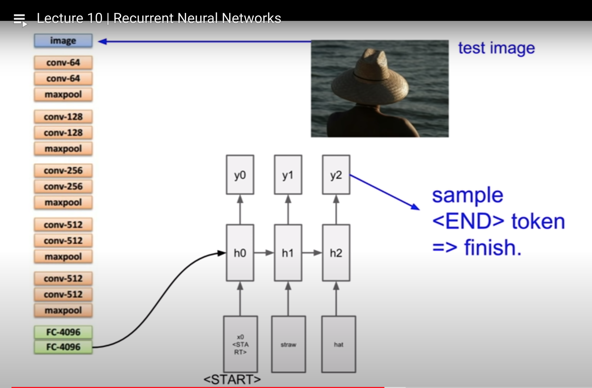
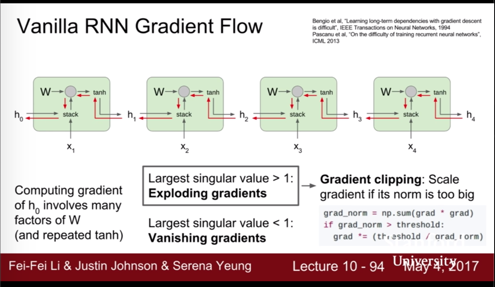
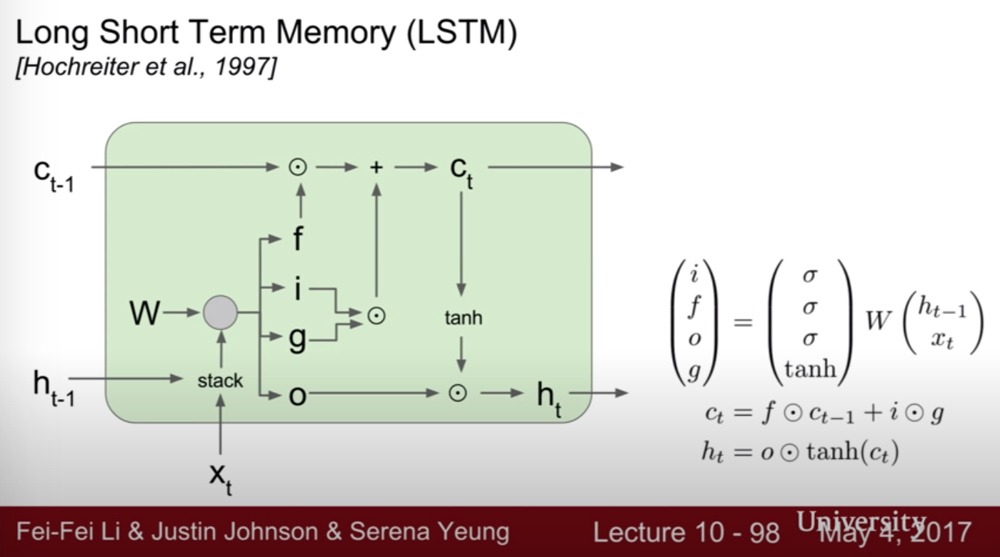
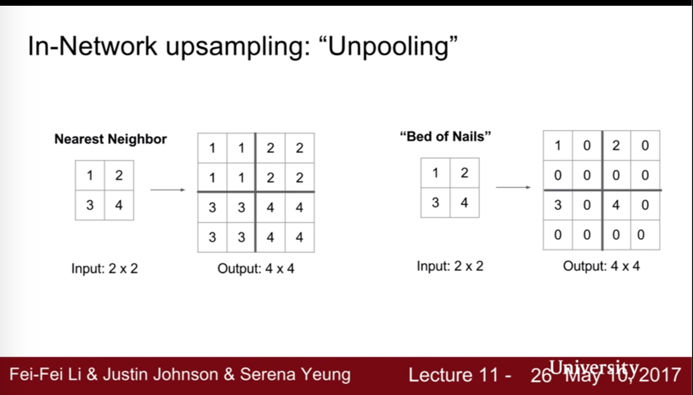
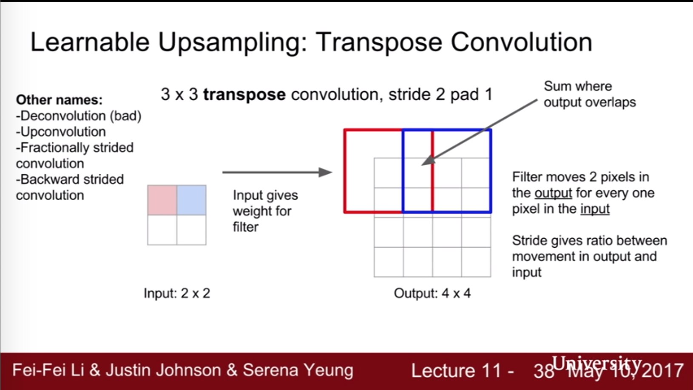
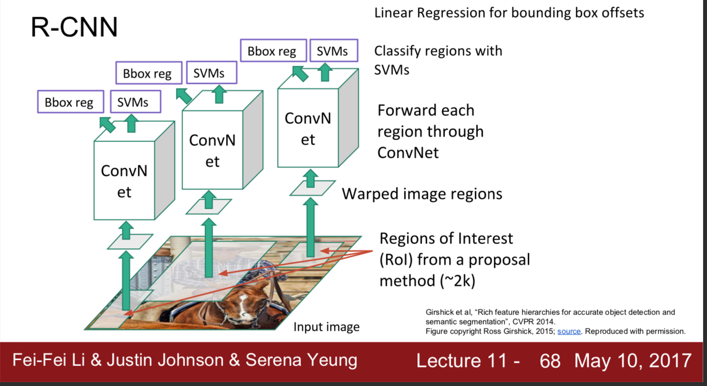
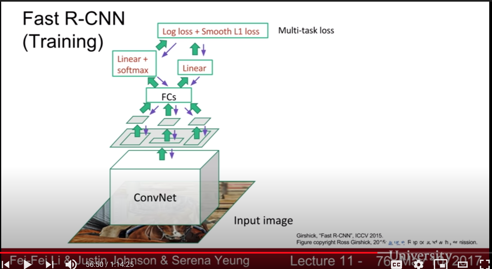
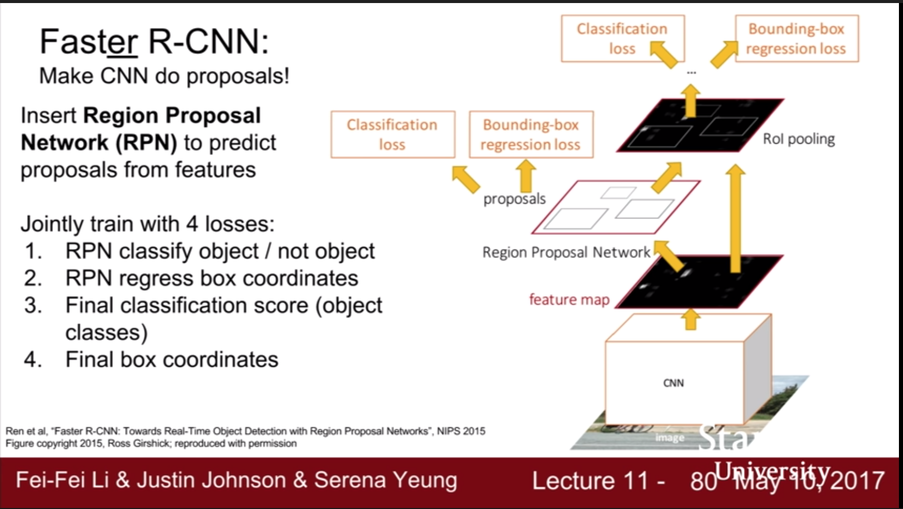

# RNN

Ref: https://www.youtube.com/watch?v=6niqTuYFZLQ&list=PLC1qU-LWwrF64f4QKQT-Vg5Wr4qEE1Zxk&index=10&ab_channel=StanfordUniversitySchoolofEngineering

Until now we have fixed size of input. 

We want more flexibility.  
- Image captionaing: image --> sequence of words (one to many)
- Sentiment classification: sequence of words --> sentiment ( many to one)
- Machine translation: sequence of words --> sequence of words (many to many)
- Video classification on frame lever ( many to many)

Input - > RNN --|
         ^ -----|

    
    h_t = fw(h_t-1, x_t)  --> input vector * old hidden state

    h_t = tanh(W_hh * h_t-1 + W_xh * x_t)
    y_ t = W_hy * h_t
    

Reuse same W (weight matrix) every time-step)

    Many to Many:
    h0 = 0
    h1 = f(h0, x1) <-- W   -> gives y1(class score) and L1 (loss)
    h2 = f(h1, x2) <-- W   -> gives y2(class score) and L2 (loss)
    ..
    ht = f(ht-1, xt) <-- W -> gives yt(class score) and Lt (loss)
    
    L = L1 + L2 .. + Lt

    Many to One:
    h0 = 0
    h1 = f(h0, x1) <-- W   
    h2 = f(h1, x2) <-- W   
    ..
    ht = f(ht-1, xt) <-- W -> gives y(class score) and L(loss)

    One to Many:
    h0 = 0
    h1 = f(h0, x) <-- W   -> gives y1(class score) and L1 (loss)
    h2 = f(h1) <-- W   -> gives y2(class score) and L2 (loss)
    ..
    ht = f(ht-1) <-- W -> gives yt(class score) and Lt (loss)
    
    L = L1 + L2 .. + Lt

Language Modeling: how do you produce natural language? It can be char level or sequence level. 

**Example:**

- HELLO: each char encoded such that: 
    
    
    h : 1 0 0 0 
    e: 0 1 0 0  
  
- Initialize the weight matrix. 
- W * input(encoded h) = 1st hidden  --> 0.3 -0.1 0.9
- W * 1st hidden + W * input(encoded e) = 2nd hidden   --> 0.3 -0.1 0.9
- Use hidden layer and each of them multiply by a weight matrix. It gives us output layer. Softmax of them gives nex predicted letter. 
- Update weight with loss. 

At test time, give an input (h) and calculate the next char. Don't take the one who has the highest probability but instead use Sampling to choose he next char. 

Why sampling? It allows diversity in the model.

**Backpropagation through time**

It can be painful if you would like to train whole wikipedia pages. :( Because we need to forward pass through all the words in wikipedia then calculate the loss and backward pass through all words and 
make a single update for the weight matrix. It is a huge effort. 

Solution: Truncated backpropagation through time. Use subsequence of data for forward and backward pass. It is like stochastic gradient descent. 
You are taking mini-batches for updating the gradient. 

## Image Captioning

- It is a supervised learning. 
- At test time take the image as input.
- Use CNN but remove the softmax classification part. 
- We have 4096 dimensional vector. 
- We will use this vector as the first hidden for RNN.

Remember that the formula is:

    h = tanh(W_hh * h_0 + W_xh * x)
    
We will add image information:
     
     h = tanh(W_hh * h_0 + W_xh * x + W_ih * v)
     
     h_0 is outout of CNN.

Read: Image Captioning with Attention

RNN and Attention models can be used in Question Answering. 

**Vanilla RNN Gradient Flow:**

For vanishing gradient, change RNN architecture (more complicated)

But LSTM is a fancier solution for vanishing and exploding gradients. 

## LSTM

- Use x (input in current state) and h (coming from pre state) and multiply them with big W matrix. 
- Produce four different gates from this output.

How?
- sigmoid(output) = input gate (i) whether to write to cell 0,1
- sigmoid(output) = forget gate (f) whether to erase cell 0,1
- sigmoid(output) = output gate (o)  how much to reveal a cell 0,1
- tanh(output) = gate gate (g) how much to write a cell -1, 1

 
! Additive connections and multiplicative gates. 

# Detection and Segmentation 

Ref: 
- Lecture: https://www.youtube.com/watch?v=nDPWywWRIRo&list=PLC1qU-LWwrF64f4QKQT-Vg5Wr4qEE1Zxk&index=11&ab_channel=StanfordUniversitySchoolofEngineering
- FCN Semantic Segmentation: https://arxiv.org/pdf/1411.4038.pdf
- Pose Estimation: https://arxiv.org/pdf/1312.4659.pdf
- R-CNN: https://arxiv.org/pdf/1311.2524.pdf
- Faster R-CNN: https://arxiv.org/pdf/1506.01497.pdf
- Mask R-CNN: https://arxiv.org/pdf/1703.06870.pdf

## Semantic Segmentation 

Every pixel in the image: grass, cat, tree, sky.. etc

It is not differentiate instances, only care about two cows.

**First approach:** Small Crops

Take the image, break it up into many small crops. For the first crop what is the category of the image. This is like a classification problem!

BUT!

It is computationally expensive! There are too many overlapping patches and we don't use shared features. All of them are 
a new CNN. No!

**Second Approach:** Use GIANT CNN

We ca use GIANT STACK OF CNN, and fined classification score of each categories. Getting training data is really hard. 

We have a ground truth of a category label for every pixel, we can calculate the loss. 
(We have fixed number of category)

It is still computationally expensive!

**Third Approach:** Downsampling & Upsampling

- Downsampling: pooling, strided convolution
- Upsampling: unpooling or strided transpose convolution

Unpooling:

Max unpooling:

Transpose Convolution:

- Input: 2x1: a,b
- Filter: 3x1: x,y,z
- Output: 6x1: ax, ay, az+bx, by, bz

## Classification + Localization

Remember the red boxes around the cat in an image :)

Let's we have a cat image. We are using AlexNet. And the Fully connected layer gives us the sores:
- cat: 0.9
- dog: 0.05 
- car: 0.01 .. etc

We have another FCN. It gives us 4 numbers: x,y,w,h. these are the coordinates of the box. 

There are two loss functions: softmax for classification. the other is the difference between the predicted coordinate box and actual coordinate box.
The second one is L2 loss. 

It is a multitask loss. You need a hyperparamater which weighs these two functions, because you want to minimize them both and their scales could be different.

⭐ ️Take the weighted sum of the two losses!!

## Multiple Object Detection 

THIS IS A CORE PROBLEM IN CV. 

PROBLEM: We have a fixed number of categories. Given an input image every time one of those categories appears in the image, 
we want to draw a box around it and we want to predict the category of that box.  

It is different than Classification + Localization problem because in that problem there is a single image and we only predict coordinate 
of one box. Now we don't know the number of objects should be predicted. 

**1st Approach**: Sliding Window

Sliding window, take small path and apply semantic segmentation. 

- Take a window.
- Is it dog? No!
- Is it cat? Yes!
- Is it background? No!

How do you choose the crops?

**2nd Approach**: Region Proposals

It gives you a thousand boxes where an object might be present. 
Draw boxes around edges. One example is Selective Search.

**3rd Approach:** R-CNN

First, use region proposals for selecting the candidate places for objects then apply CNN for each of these regions.
Read the Paper: R-CNN.

**4th Approach:** Fast R-CNN

We don't crop the proposed regions from the image. Rather we forward the whole image
 into ConvNet. 

**5th Approach:** Faster R-CNN

## Instance Segmentation

Hybrid of semantic segmentation and multiple object detection. We can detect the different objects in the image and we 
have pixel wise accuracy, which pixels belong to that object. 

Read more from Masked R-CNN.
